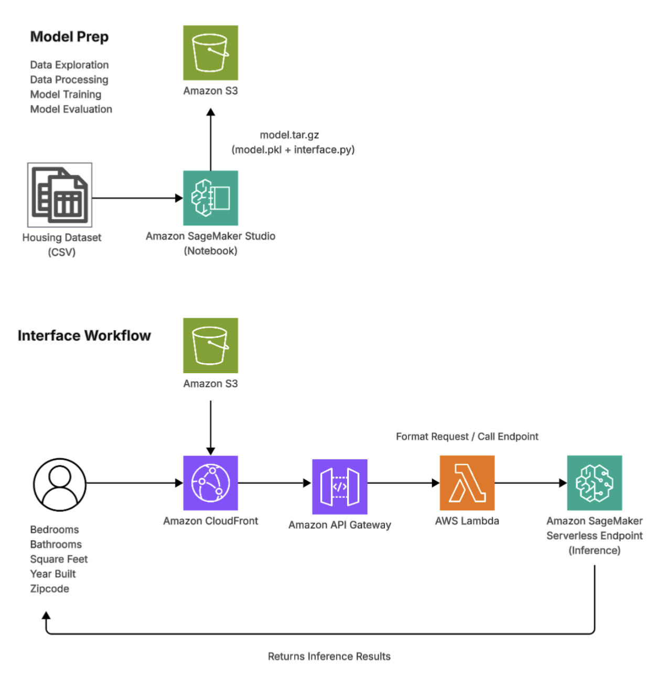

# ML House Price Prediction Application

A house price web application that provides real-time house price predictions based on user inputs, using a ML model deployed on AWS serverless infrastructure.

### 🚀 Features 🚀

- Real-time house price prediction
- Model evaluation metrics (RMSE, MAE, R²)

### 🧠 How It Works 🧠

1. User enters property details (bedrooms, bathrooms, sqft, year built, zipcode)
2. Frontend sends request to API Gateway
3. AWS Lambda invokes SageMaker Serverless Endpoint
4. Model returns prediction
5. Result is formatted and displayed in UI

### 🏗 Architecture 🏗

  
 
  Architecture diagram created with Lucidchart

### 🛠 Tech Stack 🛠

#### ▫️ Frontend

- React
- TypeScript
- Tailwind CSS

#### ▫️ Backend / AWS

- AWS Lambda
- Amazon API Gateway
- Amazon SageMaker (Serverless Inference Endpoint)
- Amazon SageMaker Studio
- Amazon CloudFront
- Amazon S3

#### ▫️ Machine Learning

- Python
- Random Forest Regressor

### 📊 Model Metrics 📊

- RMSE: $183,909
- MAE: $98,541
- R² Score: 0.73

### 📦 Setup 📦

1. `npm install`
2. `npm run dev`
